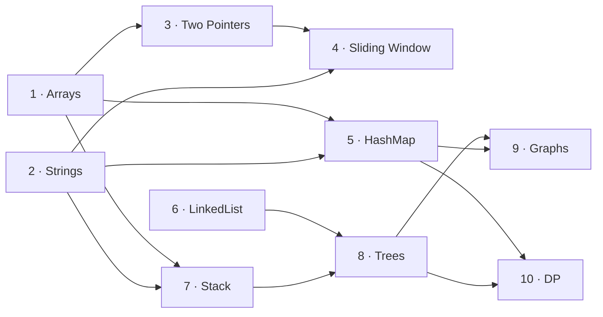

# CONTRACT: Adaptive Coding & DSA Learning Platform

Version 1.0 (Phase 1A). This file is the single source of truth. If the code, the
frontend, or the ML scripts disagree with it, they are wrong and this file wins.
Changes are made here first, then in code.

---

## 0. Conventions

- **Base URL:** `http://localhost:8080`. All endpoints are under `/api`. JSON is UTF-8.
- **IDs:** `BIGINT` in the DB, JSON numbers in the API.
- **Timestamps:** stored as UTC `TIMESTAMP` (Hibernate `jdbc.time_zone: UTC`), sent as
  ISO-8601 with `Z`, e.g. `"2026-10-02T09:15:00Z"`.
- **Enums:** uppercase strings, identical in DB (`VARCHAR` + `CHECK`) and JSON.
- **Numbers:** retention and accuracy-type values are 0–1. Readiness and gap are on a
  0–100 scale, rounded to 1 decimal in responses.
- **Long text:** `VARCHAR(n)` instead of `TEXT`. H2 maps `TEXT` to `CLOB`, which fails
  Hibernate's `ddl-auto: validate` for a `String` field. A large `VARCHAR` behaves the
  same on PostgreSQL and H2.
- **Error body** (400 / 404):
  ```json
  { "error": "NOT_FOUND", "message": "User 7 does not exist" }
  ```
  Error codes are `BAD_REQUEST`, `NOT_FOUND` and `NOT_IMPLEMENTED`.
- **Phase 1A:** every endpoint below returns **501 Not Implemented** with an empty body.

---

## 1. Enums

### Verdict
The outcome of a submission, and of each individual test run.

| Value | Meaning |
|---|---|
| `ACCEPTED` | Every test produced the expected output within the time limit |
| `WRONG_ANSWER` | Output differed from expected |
| `COMPILE_ERROR` | `javac` failed; no tests ran |
| `RUNTIME_ERROR` | The process threw an uncaught exception or exited non-zero |
| `TIME_LIMIT_EXCEEDED` | The process ran longer than `problems.time_limit_ms` and was killed |

A submission's verdict is the verdict of its **first failing test** (order in §4.1).
If no test fails, the verdict is `ACCEPTED`.

### ErrorCategory
| Value | Meaning |
|---|---|
| `SYNTAX_COMPILATION` | Code does not compile |
| `OFF_BY_ONE` | Index or bound errors at the limits of the input |
| `MISSED_EDGE_CASE` | Empty, single-element, duplicate or negative-type inputs are not handled |
| `WRONG_ALGORITHM` | The approach is wrong even on typical inputs |
| `STATE_TRANSITION` | The recurrence or state update is wrong (mainly DP) |
| `BAD_COMPLEXITY` | Too slow: time limit exceeded |
| `SUBOPTIMAL` | Correct and within the limit, but slower than the calibrated optimal runtime |

### TestTag
Declaration order is significant: it is the first-failure order.

| Value | Probes | Shown to learner before submit? |
|---|---|---|
| `SAMPLE` | Typical inputs from the statement | Yes |
| `EDGE` | Empty, single element, all-equal, negatives | No |
| `BOUNDARY` | Min/max sizes and values, first/last index | No |
| `LARGE` | Max-size input for complexity | No |

### Difficulty
Each value has a numeric weight used for `mean_difficulty`.

| Value | Weight |
|---|---|
| `EASY` | 1 |
| `MEDIUM` | 2 |
| `HARD` | 3 |

### ResourceSource
`GFG`, `YOUTUBE`.

---

## 2. Topic graph

### 2.1 Topics
A topic's `id` is its position in the fixed order and also its HLR one-hot index
(`id - 1`). Topic ids are never renumbered.

| id | name | slug |
|---|---|---|
| 1 | Arrays | arrays |
| 2 | Strings | strings |
| 3 | Two Pointers | two-pointers |
| 4 | Sliding Window | sliding-window |
| 5 | HashMap | hashmap |
| 6 | LinkedList | linkedlist |
| 7 | Stack | stack |
| 8 | Trees | trees |
| 9 | Graphs | graphs |
| 10 | DP | dp |

### 2.2 Prerequisite edges (approved)



| prerequisite → topic | Reason |
|---|---|
| Arrays → Two Pointers | Two pointers is index manipulation over an array |
| Two Pointers → Sliding Window | A window is two pointers with an invariant |
| Strings → Sliding Window | Most window problems are substring problems |
| Arrays → HashMap | Frequency and lookup problems start from array traversal |
| Strings → HashMap | Character counting is the classic first HashMap use |
| Arrays → Stack | Monotonic-stack problems run over arrays |
| Strings → Stack | Bracket matching and expression parsing |
| LinkedList → Trees | A tree node is a linked node with two `next` pointers |
| Stack → Trees | Iterative traversal and recursion's call stack |
| Trees → Graphs | DFS/BFS generalise from trees to graphs |
| HashMap → Graphs | Adjacency lists and visited sets |
| HashMap → DP | Memoization is a map cache |
| Trees → DP | Recursive decomposition into subproblems |

- The roots are Arrays, Strings and LinkedList. There is no Arrays → LinkedList edge.
- The constraint `CHECK (prerequisite_id < topic_id)` means every edge points forward
  in the fixed order, so the database itself makes a cycle impossible.

### 2.3 Unlock rule (hard gate)
A topic is **unlocked** for a user when it has no prerequisites, or when **every**
prerequisite `P` satisfies both of these:

- `predicted_retention(P) >= app.unlock.min-retention` (default `0.6`)
- `topic_state(P).correct_count >= app.unlock.min-correct-count` (default `2`)

A prerequisite with no `topic_state` row fails both checks. The thresholds live in
`application.yml`, not in the DB.

Unlocking has these effects:
- Locked topics are excluded from recommendations.
- Locked topics are shown as locked on the topic map.
- The learner can still open and submit any problem manually.

Unlock status is computed live, so a topic can **re-lock** as a prerequisite's
retention decays below the threshold. This is intended: it is what makes the gate
reflect current mastery.

---

## 3. Tables

Legend: **PK** primary key, **FK** foreign key, **UQ** unique, **NN** not null.

### users
| Column | Type | Constraints | Notes |
|---|---|---|---|
| id | BIGINT identity | PK | |
| display_name | VARCHAR(50) | NN, UQ | Seeded with "Alex" and "Sam" |
| created_at | TIMESTAMP | NN, default now | |

The `users.self_rated_readiness` column was dropped; self-rating is per topic in `topic_state`.

### topics
| Column | Type | Constraints | Notes |
|---|---|---|---|
| id | BIGINT | PK, CHECK 1..10 | Not generated (see §2.1) |
| name | VARCHAR(40) | NN, UQ | |
| slug | VARCHAR(40) | NN, UQ | |

### topic_prerequisites
| Column | Type | Constraints | Notes |
|---|---|---|---|
| topic_id | BIGINT | PK part, FK → topics | The topic being gated |
| prerequisite_id | BIGINT | PK part, FK → topics | Must be mastered first |

The table also has `CHECK (prerequisite_id < topic_id)`. There is no weight column.

### problems
| Column | Type | Constraints | Notes |
|---|---|---|---|
| id | BIGINT identity | PK | |
| topic_id | BIGINT | NN, FK → topics | Exactly one topic per problem |
| title | VARCHAR(120) | NN | |
| slug | VARCHAR(120) | NN, UQ | |
| difficulty | VARCHAR(10) | NN, CHECK Difficulty | |
| statement | VARCHAR(20000) | NN | Markdown |
| input_format | VARCHAR(4000) | NN | Exact stdin layout |
| output_format | VARCHAR(4000) | NN | Exact stdout layout |
| starter_code | VARCHAR(20000) | NN | `Main` class with stdin parsing and an empty `solve()` |
| time_limit_ms | INTEGER | NN, default 2000, > 0 | Per test process |
| optimal_runtime_ms | INTEGER | nullable, > 0 | Calibrated from the reference solution; NULL means no SUBOPTIMAL check |
| target_solve_seconds | INTEGER | NN, > 0 | Expected solve time; used by `speed_vs_target` |

Indexes: `(topic_id)`.

### test_cases
| Column | Type | Constraints | Notes |
|---|---|---|---|
| id | BIGINT identity | PK | |
| problem_id | BIGINT | NN, FK → problems | |
| tag | VARCHAR(10) | NN, CHECK TestTag | |
| ordinal | INTEGER | NN, ≥ 1, UQ with problem_id | Run order within a tag |
| input | VARCHAR(1000000) | NN | Raw stdin |
| expected_output | VARCHAR(1000000) | NN | Raw expected stdout |
| error_category_override | VARCHAR(30) | nullable, CHECK ErrorCategory | Curator override (§4.2) |

Seeding rule: a problem has 6–8 tests and at least 1 `SAMPLE`. This is enforced by
whoever writes the seed, not by a constraint. Ordinals should follow tag order
(SAMPLE first) so that ordinal order matches run order.

### attempts
| Column | Type | Constraints | Notes |
|---|---|---|---|
| id | BIGINT identity | PK | |
| user_id | BIGINT | NN, FK → users | |
| problem_id | BIGINT | NN, FK → problems | |
| code | VARCHAR(65535) | NN | Submitted source |
| verdict | VARCHAR(25) | NN, CHECK Verdict | |
| passed_count | INTEGER | NN, 0..total_count | |
| total_count | INTEGER | NN | 0 for COMPILE_ERROR |
| large_runtime_ms | INTEGER | nullable | Max runtime over LARGE tests |
| time_spent_seconds | INTEGER | nullable, ≥ 0 | Client-measured, from problem open to submit |
| submitted_at | TIMESTAMP | NN | |

Indexes: `(user_id, submitted_at)`.

### error_events
| Column | Type | Constraints | Notes |
|---|---|---|---|
| id | BIGINT identity | PK | |
| attempt_id | BIGINT | NN, **UQ**, FK → attempts | At most one event per submission |
| user_id | BIGINT | NN, FK → users | |
| topic_id | BIGINT | NN, FK → topics | Copied from the problem for cheap grouping |
| error_category | VARCHAR(30) | NN, CHECK ErrorCategory | |
| failed_tag | VARCHAR(10) | nullable, CHECK TestTag | NULL only for SYNTAX_COMPILATION |
| failed_test_case_id | BIGINT | nullable, FK → test_cases | |
| exception_type | VARCHAR(120) | nullable | e.g. `ArrayIndexOutOfBoundsException` |
| occurred_at | TIMESTAMP | NN | Equals `attempts.submitted_at` |

Indexes: `(user_id, occurred_at)`.

### topic_state
One row per (user, topic). The row is created lazily on the first submission or the
first self-rating in that topic.

| Column | Type | Constraints | Notes |
|---|---|---|---|
| id | BIGINT identity | PK | Surrogate key; simpler JPA mapping than a composite key |
| user_id | BIGINT | NN, FK → users, UQ with topic_id | |
| topic_id | BIGINT | NN, FK → topics | |
| correct_count | INTEGER | NN, default 0, ≥ 0 | +1 per ACCEPTED submission |
| wrong_count | INTEGER | NN, default 0, ≥ 0 | +1 per any other verdict |
| mean_difficulty | DOUBLE PRECISION | nullable, 1..3 | Mean difficulty weight over this topic's attempts |
| last_practiced_at | TIMESTAMP | nullable | Time of the latest submission in this topic |
| half_life_days | DOUBLE PRECISION | nullable, > 0 | Recomputed after each submission (§4.3) |
| self_rating | INTEGER | nullable, 1..5 | NULL until the learner rates the topic |

Retention is **not stored**, because it changes continuously. It is computed on request.

### readiness_snapshots
| Column | Type | Constraints | Notes |
|---|---|---|---|
| id | BIGINT identity | PK | |
| user_id | BIGINT | NN, FK → users | |
| taken_at | TIMESTAMP | NN | |
| overall_self_rating | DOUBLE PRECISION | nullable, 1..5 | Mean of the per-topic ratings that are set |
| overall_computed | DOUBLE PRECISION | nullable, 0..100 | NULL if the user has no attempts |
| gap | DOUBLE PRECISION | nullable | `overall_self_rating*20 - overall_computed`; NULL if either side is NULL |

A snapshot is written after **every submission** and **every self-rating change**.
Per-topic detail is never stored; it is computed live. Indexes: `(user_id, taken_at)`.

### resources
| Column | Type | Constraints | Notes |
|---|---|---|---|
| id | BIGINT identity | PK | |
| topic_id | BIGINT | nullable, FK → topics | NULL means a generic link for the category |
| error_category | VARCHAR(30) | NN, CHECK ErrorCategory | |
| title | VARCHAR(200) | NN | |
| url | VARCHAR(500) | NN | Human-verified link only |
| source | VARCHAR(10) | NN, CHECK GFG/YOUTUBE | |
| rank | INTEGER | NN, ≥ 1 | Lower rank is shown first |

This table is empty after seeding and is filled only by a separately supplied
`resources.sql`. Indexes: `(error_category, topic_id)`.

---

## 4. Domain rules

These rules are specified now so that the schema and API agree. They are implemented
in later phases.

### 4.1 Submission pipeline
1. Compile the code **once** with `javac Main.java`. If compilation fails, the verdict
   is `COMPILE_ERROR`, no tests run, and `total_count = 0`.
2. Order the tests by tag (`SAMPLE → EDGE → BOUNDARY → LARGE`), then by `ordinal`.
   Run **every** test in that order, each as its **own** `java Main` process with
   `input` on stdin. Each process is killed after `time_limit_ms`.
3. **Output comparison:** strip trailing whitespace from each line and drop trailing
   empty lines on both sides, then compare exactly.
4. Each test gets its own verdict: `ACCEPTED`, `WRONG_ANSWER`, `RUNTIME_ERROR` or
   `TIME_LIMIT_EXCEEDED`.
5. The submission verdict is the verdict of the first failing test in run order, or
   `ACCEPTED` if none fail.
6. `large_runtime_ms` is the maximum runtime over the LARGE tests. It is NULL if the
   problem has no LARGE test or no LARGE test ran to completion.

### 4.2 Error-category resolution
Steps are applied in order, and the first matching step wins.

| # | Condition | Category |
|---|---|---|
| 1 | Verdict `COMPILE_ERROR` | `SYNTAX_COMPILATION` (`failed_tag` NULL) |
| — | Otherwise take the **first failing test** `F` in run order | |
| 2 | `F` is `TIME_LIMIT_EXCEEDED` (any tag) | `BAD_COMPLEXITY` |
| 3 | `F` is `RUNTIME_ERROR` and the exception is `ArrayIndexOutOfBoundsException` or `StringIndexOutOfBoundsException` | `OFF_BY_ONE` |
| 4 | `F.error_category_override` is not NULL | that override |
| 5 | Otherwise, by `F.tag` | `SAMPLE` → `WRONG_ALGORITHM`, `EDGE` → `MISSED_EDGE_CASE`, `BOUNDARY` → `OFF_BY_ONE`, `LARGE` → `BAD_COMPLEXITY` |
| 6 | The result of step 5 is `WRONG_ALGORITHM` and the problem's topic is DP | `STATE_TRANSITION` |
| — | **No test failed** | |
| 7 | `optimal_runtime_ms` is not NULL and `large_runtime_ms > optimal_runtime_ms` | `SUBOPTIMAL` (verdict stays `ACCEPTED`, `failed_tag = LARGE`, `failed_test_case_id` is the slowest LARGE test) |
| 8 | Otherwise | no category, no `error_event` |

Step 6 applies only to the tag mapping in step 5, so an explicit override (step 4)
always beats it. Exactly one `error_event` is written for steps 1–7.

### 4.3 Retention: half-life regression (HLR)
The feature vector `x` has 14 values, in this exact order:

| idx | Feature | Value |
|---|---|---|
| 0 | `bias` | 1 |
| 1 | `sqrt_correct` | `sqrt(1 + correct_count)` |
| 2 | `sqrt_wrong` | `sqrt(1 + wrong_count)` |
| 3 | `mean_difficulty` | `topic_state.mean_difficulty` (1..3) |
| 4–13 | `topic_arrays` … `topic_dp` | One-hot: 1 at index `3 + topic_id`, 0 elsewhere |

The model is evaluated as follows:

```
h = clamp(2^(theta · x), min_h, max_h)      // half-life in days
p = 2^(-delta_days / h)                     // predicted recall, 0..1
delta_days = (now - last_practiced_at) in fractional days
```

After each submission in topic `T`, these updates are made in this order:
1. Update `correct_count` or `wrong_count`.
2. Update `mean_difficulty` as `(old_mean * n + weight) / (n + 1)`, where
   `n = correct_count + wrong_count` **before** step 1.
3. Set `last_practiced_at = submitted_at`.
4. Recompute and store `half_life_days` from the new features.

A topic with no attempts has `predicted_retention = null`.

### 4.4 Readiness
**Topic readiness** is computed only for topics with at least 1 attempt; otherwise it is `null`.

```
readiness = 100 * (0.35*recent_accuracy + 0.30*retention + 0.20*consistency + 0.15*speed_vs_target)
```

The components are defined as follows:
- `recent_accuracy` = ACCEPTED ÷ attempts, over the user's last
  `app.readiness.recent-attempts` attempts (default 10) in that topic.
- `retention` = `p` from §4.3, computed now.
- `consistency` = the number of distinct UTC days in the last 14 days with at least
  1 attempt in **any** topic, divided by 14. This value is the same for every topic.
- `speed_vs_target` = the mean of `min(1, target_solve_seconds / time_spent_seconds)`
  over the ACCEPTED attempts among those same recent attempts, ignoring rows with NULL
  or 0 `time_spent_seconds`. It is 0 if there are none.

The **topic gap** is `self_rating*20 - readiness`. It is `null` if either value is `null`.

The overall values are:
- **Overall computed** is the mean of topic readiness over topics with at least 1
  attempt. It is `null` if there are none.
- **Evidence coverage** is the number of topics attempted divided by 10.
- **Overall self-rating** is the mean of the per-topic ratings that are set, even on
  topics with no attempts. It is `null` if none are set.
- **Overall gap** is `overall_self_rating*20 - overall_computed`. A positive gap
  means the learner rates themselves higher than the evidence supports.

### 4.5 Resources and fallback
For an `(error_category, topic)` pair, links are chosen as follows:

1. Return up to **3** curated rows: first those with `topic_id = topic`, ordered by
   `rank`, then generic rows with `topic_id IS NULL`, ordered by `rank`.
2. If there are **no** curated rows, return exactly two **generated search links**,
   marked `"generated": true`.
   - **GFG:** `https://www.google.com/search?q=site%3Ageeksforgeeks.org+<q>`
   - **YOUTUBE:** `https://www.youtube.com/results?search_query=<q>`

   Here `<q>` is the URL-encoded string `"<topic name> <phrase> java"`, using the
   phrase from the table below. The backend never builds a direct article or video
   URL itself.

| Category | Search phrase |
|---|---|
| SYNTAX_COMPILATION | java compilation errors |
| OFF_BY_ONE | off by one error |
| MISSED_EDGE_CASE | edge cases |
| WRONG_ALGORITHM | approach explained |
| STATE_TRANSITION | dp state transition |
| BAD_COMPLEXITY | time complexity optimization |
| SUBOPTIMAL | optimal solution |

---

## 5. REST endpoints

Problem ids in the examples are illustrative, because problems are seeded in a later
phase. Curated URLs are never shown in examples; only the generated-search format is
real.

### 5.1 `POST /api/submissions`
This endpoint compiles and runs the code, stores an attempt (and an error_event if
applicable), updates `topic_state`, and writes a readiness snapshot.

**Request**
```json
{
  "userId": 1,
  "problemId": 14,
  "code": "import java.io.*;\nimport java.util.*;\n\npublic class Main {\n    static int[] solve(int[] nums, int target) { ... }\n    public static void main(String[] args) throws IOException { ... }\n}\n",
  "timeSpentSeconds": 640
}
```
`timeSpentSeconds` is optional (nullable).

**Response 200** (example: WRONG_ANSWER, first failure on an EDGE test)
```json
{
  "attemptId": 87,
  "userId": 1,
  "problemId": 14,
  "topicId": 3,
  "verdict": "WRONG_ANSWER",
  "passedCount": 5,
  "totalCount": 7,
  "errorCategory": "MISSED_EDGE_CASE",
  "failedTest": {
    "testCaseId": 303,
    "tag": "EDGE",
    "ordinal": 3,
    "input": null,
    "expectedOutput": null,
    "actualOutput": null
  },
  "message": "Wrong answer on an EDGE test.",
  "largeRuntimeMs": 212,
  "optimalRuntimeMs": 250,
  "testResults": [
    { "ordinal": 1, "tag": "SAMPLE",   "verdict": "ACCEPTED",     "runtimeMs": 48 },
    { "ordinal": 2, "tag": "SAMPLE",   "verdict": "ACCEPTED",     "runtimeMs": 45 },
    { "ordinal": 3, "tag": "EDGE",     "verdict": "WRONG_ANSWER", "runtimeMs": 44 },
    { "ordinal": 4, "tag": "EDGE",     "verdict": "ACCEPTED",     "runtimeMs": 46 },
    { "ordinal": 5, "tag": "BOUNDARY", "verdict": "WRONG_ANSWER", "runtimeMs": 47 },
    { "ordinal": 6, "tag": "BOUNDARY", "verdict": "ACCEPTED",     "runtimeMs": 51 },
    { "ordinal": 7, "tag": "LARGE",    "verdict": "ACCEPTED",     "runtimeMs": 212 }
  ],
  "resources": [
    {
      "title": "GeeksforGeeks search: Two Pointers edge cases java",
      "url": "https://www.google.com/search?q=site%3Ageeksforgeeks.org+Two+Pointers+edge+cases+java",
      "source": "GFG",
      "generated": true
    },
    {
      "title": "YouTube search: Two Pointers edge cases java",
      "url": "https://www.youtube.com/results?search_query=Two+Pointers+edge+cases+java",
      "source": "YOUTUBE",
      "generated": true
    }
  ],
  "submittedAt": "2026-10-02T09:15:00Z"
}
```

Field rules:
- `failedTest` is `null` when no test failed and the attempt is not SUBOPTIMAL.
- `failedTest.input`, `expectedOutput` and `actualOutput` are filled **only for SAMPLE**
  tests. For hidden tags they are `null`, so hidden tests are not leaked.
- `message` holds the compiler output for COMPILE_ERROR, the exception class name for
  RUNTIME_ERROR, and otherwise a one-line summary.
- `errorCategory` and `resources` are `null` and `[]` respectively for a clean ACCEPTED.

**Variant: COMPILE_ERROR**
```json
{ "attemptId": 88, "userId": 1, "problemId": 14, "topicId": 3,
  "verdict": "COMPILE_ERROR", "passedCount": 0, "totalCount": 0,
  "errorCategory": "SYNTAX_COMPILATION", "failedTest": null,
  "message": "Main.java:7: error: ';' expected",
  "largeRuntimeMs": null, "optimalRuntimeMs": 250, "testResults": [],
  "resources": [ "...2 links..." ], "submittedAt": "2026-10-02T09:18:10Z" }
```

**Variant: ACCEPTED but SUBOPTIMAL**
```json
{ "attemptId": 89, "userId": 1, "problemId": 14, "topicId": 3,
  "verdict": "ACCEPTED", "passedCount": 7, "totalCount": 7,
  "errorCategory": "SUBOPTIMAL",
  "failedTest": { "testCaseId": 307, "tag": "LARGE", "ordinal": 7,
                  "input": null, "expectedOutput": null, "actualOutput": null },
  "message": "All tests passed, but LARGE took 610 ms (optimal 250 ms).",
  "largeRuntimeMs": 610, "optimalRuntimeMs": 250, "testResults": [ "...7 rows..." ],
  "resources": [ "...links..." ], "submittedAt": "2026-10-02T09:25:40Z" }
```

**Errors**
- 400 if `code` is blank or `userId`/`problemId` is missing.
- 404 if the user or problem does not exist.

### 5.2 `GET /api/users`
**Response 200**
```json
[
  { "id": 1, "displayName": "Alex" },
  { "id": 2, "displayName": "Sam" }
]
```

### 5.3 `GET /api/users/{id}/retention`
The response always contains all 10 topics in fixed order. Untouched topics have
`attempted: false` and null model fields.

**Response 200**
```json
{
  "userId": 1,
  "computedAt": "2026-10-02T09:15:00Z",
  "topics": [
    { "topicId": 1, "name": "Arrays", "attempted": true,
      "correctCount": 5, "wrongCount": 2, "meanDifficulty": 1.43,
      "lastPracticedAt": "2026-09-29T11:39:00Z", "daysSinceLastPractice": 2.9,
      "halfLifeDays": 6.2, "predictedRetention": 0.72 },
    { "topicId": 2, "name": "Strings", "attempted": true,
      "correctCount": 3, "wrongCount": 3, "meanDifficulty": 1.5,
      "lastPracticedAt": "2026-09-29T17:10:00Z", "daysSinceLastPractice": 2.67,
      "halfLifeDays": 3.1, "predictedRetention": 0.55 },
    { "topicId": 3, "name": "Two Pointers", "attempted": true,
      "correctCount": 2, "wrongCount": 4, "meanDifficulty": 1.33,
      "lastPracticedAt": "2026-09-29T19:30:00Z", "daysSinceLastPractice": 2.57,
      "halfLifeDays": 2.0, "predictedRetention": 0.41 },
    { "topicId": 4, "name": "Sliding Window", "attempted": false,
      "correctCount": 0, "wrongCount": 0, "meanDifficulty": null,
      "lastPracticedAt": null, "daysSinceLastPractice": null,
      "halfLifeDays": null, "predictedRetention": null }
  ]
}
```
Topics 5–10 are omitted in this example; the real response always contains all 10.
**Errors:** 404 if the user does not exist.

### 5.4 `GET /api/users/{id}/recommendations?limit=5`
`limit` is optional, defaults to 5, and is capped at 20. Problems from **locked**
topics are never returned. The scoring algorithm is defined in the recommendation
phase; this phase fixes only the shape.

**Response 200**
```json
{
  "userId": 1,
  "generatedAt": "2026-10-02T09:15:00Z",
  "items": [
    { "problemId": 15, "title": "Remove Duplicates from Sorted Array",
      "topicId": 3, "topicName": "Two Pointers", "difficulty": "EASY",
      "score": 0.82,
      "reason": "Two Pointers retention is 0.41; it must reach 0.6 to unlock Sliding Window." },
    { "problemId": 7, "title": "Reverse Words in a String",
      "topicId": 2, "topicName": "Strings", "difficulty": "MEDIUM",
      "score": 0.74,
      "reason": "Strings retention is 0.55 and it gates HashMap, Stack and Sliding Window." },
    { "problemId": 21, "title": "Reverse a Linked List",
      "topicId": 6, "topicName": "LinkedList", "difficulty": "EASY",
      "score": 0.6,
      "reason": "LinkedList is unlocked and not yet attempted; it gates Trees." }
  ]
}
```
**Errors:** 404 if the user does not exist; 400 if `limit < 1`.

### 5.5 `GET /api/users/{id}/weakness`
This is the recurring-error profile over **all** of the user's error_events.

- Categories with a count of 0 are omitted.
- Categories are sorted by `count` descending, then by `lastSeenAt` descending.
- Each category's `resources` are chosen for the topic with the most events in that
  category (§4.5).

**Response 200**
```json
{
  "userId": 1,
  "totalErrorEvents": 9,
  "categories": [
    {
      "category": "MISSED_EDGE_CASE", "count": 4, "share": 0.44,
      "lastSeenAt": "2026-09-29T19:30:00Z",
      "topics": [
        { "topicId": 3, "name": "Two Pointers", "count": 3 },
        { "topicId": 1, "name": "Arrays", "count": 1 }
      ],
      "resources": [
        { "title": "GeeksforGeeks search: Two Pointers edge cases java",
          "url": "https://www.google.com/search?q=site%3Ageeksforgeeks.org+Two+Pointers+edge+cases+java",
          "source": "GFG", "generated": true },
        { "title": "YouTube search: Two Pointers edge cases java",
          "url": "https://www.youtube.com/results?search_query=Two+Pointers+edge+cases+java",
          "source": "YOUTUBE", "generated": true }
      ]
    },
    {
      "category": "OFF_BY_ONE", "count": 3, "share": 0.33,
      "lastSeenAt": "2026-09-29T11:39:00Z",
      "topics": [ { "topicId": 1, "name": "Arrays", "count": 3 } ],
      "resources": [ "...same shape..." ]
    },
    {
      "category": "WRONG_ALGORITHM", "count": 2, "share": 0.22,
      "lastSeenAt": "2026-09-28T16:02:00Z",
      "topics": [ { "topicId": 2, "name": "Strings", "count": 2 } ],
      "resources": [ "...same shape..." ]
    }
  ]
}
```
A curated resource has the same shape, with `"generated": false` and its URL taken
verbatim from `resources.url`. **Errors:** 404 if the user does not exist.

### 5.6 `GET /api/users/{id}/readiness`
`history` contains the last 30 snapshots, oldest first, for the chart. Topics 4–10 are
omitted below; the real response always contains all 10 topics.

**Response 200**
```json
{
  "userId": 1,
  "computedAt": "2026-10-02T09:15:00Z",
  "overall": {
    "computed": 60.0,
    "selfRating": 3.5,
    "selfRatingScaled": 70.0,
    "gap": 10.0,
    "evidenceCoverage": 0.3
  },
  "consistency": 0.5,
  "topics": [
    { "topicId": 1, "name": "Arrays", "attempted": true, "readiness": 73.1,
      "components": { "recentAccuracy": 0.8, "retention": 0.72, "consistency": 0.5, "speedVsTarget": 0.9 },
      "selfRating": 4, "gap": 6.9 },
    { "topicId": 2, "name": "Strings", "attempted": true, "readiness": 58.0,
      "components": { "recentAccuracy": 0.6, "retention": 0.55, "consistency": 0.5, "speedVsTarget": 0.7 },
      "selfRating": 3, "gap": 2.0 },
    { "topicId": 3, "name": "Two Pointers", "attempted": true, "readiness": 48.8,
      "components": { "recentAccuracy": 0.5, "retention": 0.41, "consistency": 0.5, "speedVsTarget": 0.6 },
      "selfRating": null, "gap": null },
    { "topicId": 4, "name": "Sliding Window", "attempted": false, "readiness": null,
      "components": null, "selfRating": null, "gap": null }
  ],
  "history": [
    { "takenAt": "2026-09-29T17:10:00Z", "overallSelfRating": 3.5, "overallComputed": 57.2, "gap": 12.8 },
    { "takenAt": "2026-09-29T19:30:00Z", "overallSelfRating": 3.5, "overallComputed": 60.0, "gap": 10.0 }
  ]
}
```
**Errors:** 404 if the user does not exist.

### 5.7 `POST /api/users/{id}/self-rating`
This endpoint sets one topic's rating, creating the `topic_state` row if it is
missing, and writes a snapshot.

**Request**
```json
{ "topicId": 3, "rating": 4 }
```
**Response 200**
```json
{
  "userId": 1,
  "topicId": 3,
  "selfRating": 4,
  "overallSelfRating": 3.67,
  "snapshot": {
    "id": 42,
    "takenAt": "2026-10-02T09:20:00Z",
    "overallSelfRating": 3.67,
    "overallComputed": 60.0,
    "gap": 13.3
  }
}
```
**Errors:**
- 400 if `rating` is outside 1..5 or `topicId` is missing.
- 404 if the user or topic does not exist.

### 5.8 `GET /api/topics/graph?userId={id}`
`userId` is **required**, because unlock status is per learner. All 10 nodes and all
13 edges are always returned.

**Response 200**
```json
{
  "userId": 1,
  "thresholds": { "minRetention": 0.6, "minCorrectCount": 2 },
  "nodes": [
    { "id": 1,  "name": "Arrays",         "unlocked": true,  "attempted": true,  "predictedRetention": 0.72, "correctCount": 5 },
    { "id": 2,  "name": "Strings",        "unlocked": true,  "attempted": true,  "predictedRetention": 0.55, "correctCount": 3 },
    { "id": 3,  "name": "Two Pointers",   "unlocked": true,  "attempted": true,  "predictedRetention": 0.41, "correctCount": 2 },
    { "id": 4,  "name": "Sliding Window", "unlocked": false, "attempted": false, "predictedRetention": null, "correctCount": 0 },
    { "id": 5,  "name": "HashMap",        "unlocked": false, "attempted": false, "predictedRetention": null, "correctCount": 0 },
    { "id": 6,  "name": "LinkedList",     "unlocked": true,  "attempted": false, "predictedRetention": null, "correctCount": 0 },
    { "id": 7,  "name": "Stack",          "unlocked": false, "attempted": false, "predictedRetention": null, "correctCount": 0 },
    { "id": 8,  "name": "Trees",          "unlocked": false, "attempted": false, "predictedRetention": null, "correctCount": 0 },
    { "id": 9,  "name": "Graphs",         "unlocked": false, "attempted": false, "predictedRetention": null, "correctCount": 0 },
    { "id": 10, "name": "DP",             "unlocked": false, "attempted": false, "predictedRetention": null, "correctCount": 0 }
  ],
  "edges": [
    { "from": 1, "to": 3 }, { "from": 3, "to": 4 }, { "from": 2, "to": 4 },
    { "from": 1, "to": 5 }, { "from": 2, "to": 5 }, { "from": 1, "to": 7 },
    { "from": 2, "to": 7 }, { "from": 6, "to": 8 }, { "from": 7, "to": 8 },
    { "from": 8, "to": 9 }, { "from": 5, "to": 9 }, { "from": 5, "to": 10 },
    { "from": 8, "to": 10 }
  ]
}
```
In this example, HashMap and Stack are locked because Strings retention (0.55) is
below 0.6, and Sliding Window is locked because Two Pointers retention is 0.41.
`from` is the prerequisite and `to` is the gated topic.

**Errors:** 400 if `userId` is missing; 404 if the user does not exist.

### 5.9 `GET /api/problems?topicId=&difficulty=`
Both filters are optional. Results are ordered by topic id, then difficulty, then id.
Problems are listed regardless of lock state.

**Response 200**
```json
[
  { "id": 14, "title": "Pair With Target Sum (Sorted)", "slug": "pair-target-sum-sorted",
    "topicId": 3, "topicName": "Two Pointers", "difficulty": "EASY" },
  { "id": 15, "title": "Remove Duplicates from Sorted Array", "slug": "remove-duplicates-sorted",
    "topicId": 3, "topicName": "Two Pointers", "difficulty": "EASY" }
]
```
**Errors:** 400 if `difficulty` is not a valid enum value.

### 5.10 `GET /api/problems/{id}`
Only SAMPLE tests are included. `testCount` is the total number of tests, including
hidden ones.

**Response 200**
```json
{
  "id": 14,
  "title": "Pair With Target Sum (Sorted)",
  "slug": "pair-target-sum-sorted",
  "topic": { "id": 3, "name": "Two Pointers" },
  "difficulty": "EASY",
  "statement": "Given a sorted array `nums` and an integer `target`, print 0-based indices `i < j` such that `nums[i] + nums[j] == target`, or `-1 -1` if no pair exists.",
  "inputFormat": "Line 1: n\nLine 2: n space-separated integers (sorted)\nLine 3: target",
  "outputFormat": "Two integers i and j separated by a space",
  "starterCode": "import java.io.*;\nimport java.util.*;\n\npublic class Main {\n    // Return {i, j} with i < j and nums[i] + nums[j] == target, or {-1, -1}.\n    static int[] solve(int[] nums, int target) {\n        // TODO: write your algorithm here\n        return new int[]{-1, -1};\n    }\n\n    public static void main(String[] args) throws IOException {\n        BufferedReader br = new BufferedReader(new InputStreamReader(System.in));\n        int n = Integer.parseInt(br.readLine().trim());\n        StringTokenizer st = new StringTokenizer(br.readLine());\n        int[] nums = new int[n];\n        for (int i = 0; i < n; i++) nums[i] = Integer.parseInt(st.nextToken());\n        int target = Integer.parseInt(br.readLine().trim());\n        int[] ans = solve(nums, target);\n        System.out.println(ans[0] + \" \" + ans[1]);\n    }\n}\n",
  "timeLimitMs": 2000,
  "targetSolveSeconds": 900,
  "sampleTests": [
    { "ordinal": 1, "input": "4\n2 7 11 15\n9\n", "expectedOutput": "0 1\n" },
    { "ordinal": 2, "input": "3\n1 2 3\n7\n", "expectedOutput": "-1 -1\n" }
  ],
  "testCount": 7
}
```
**Errors:** 404 if the problem does not exist.

---

## 6. `hlr_weights.json` (produced offline in Python, read by Java)

Location: `backend/src/main/resources/ml/hlr_weights.json`.

```json
{
  "feature_order": [
    "bias", "sqrt_correct", "sqrt_wrong", "mean_difficulty",
    "topic_arrays", "topic_strings", "topic_two_pointers", "topic_sliding_window",
    "topic_hashmap", "topic_linkedlist", "topic_stack", "topic_trees",
    "topic_graphs", "topic_dp"
  ],
  "theta": [0.42, 1.10, -0.65, -0.30, 0.20, 0.05, -0.10, -0.25, 0.00, 0.10, 0.05, -0.15, -0.30, -0.40],
  "min_h": 0.25,
  "max_h": 180.0,
  "metrics": { "mae_recall": 0.14, "auc": 0.71, "n_train": 4200, "n_test": 1050 }
}
```

The numbers above are placeholders that show the shape only. Java must **refuse to
start** unless both of these hold:
- `feature_order` equals the list above exactly.
- `theta.length == 14`.

This guards against silently using weights trained with a different feature order.

---

## 7. Configuration keys (`application.yml`)

| Key | Default | Used by |
|---|---|---|
| `app.cors.allowed-origin` | `http://localhost:5173` | CORS |
| `app.unlock.min-retention` | `0.6` | Unlock rule (§2.3) |
| `app.unlock.min-correct-count` | `2` | Unlock rule (§2.3) |
| `app.readiness.recent-attempts` | `10` | `recent_accuracy`, `speed_vs_target` (§4.4) |
| `app.hlr.weights-path` | `classpath:ml/hlr_weights.json` | HLR inference (§4.3) |

Profiles:
- `h2` is the default and uses an in-memory DB in PostgreSQL mode.
- `postgres` uses `localhost:${DB_PORT:5432}/dsa_platform` with user `dsa` and
  password `dsa`.
